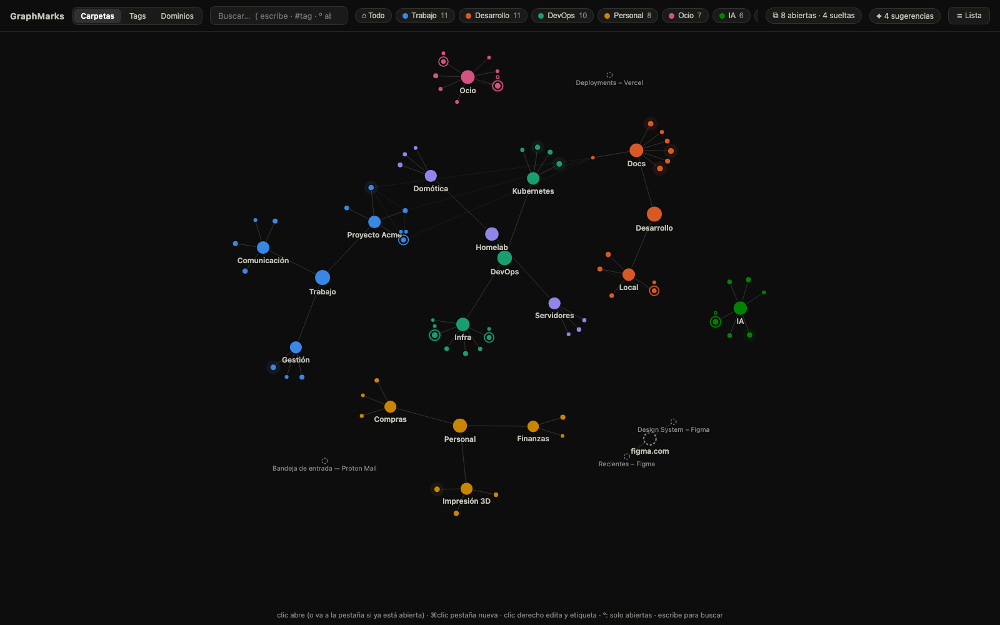
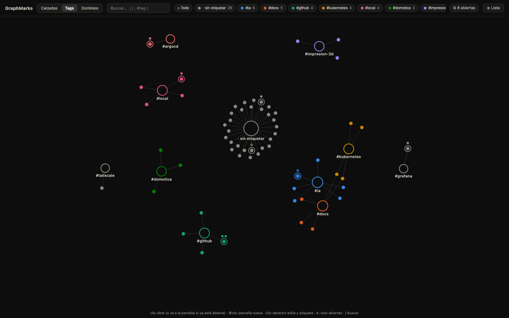

# Graphacker — Marcadores en grafo

Extensión de Chrome (Manifest V3, TypeScript) que reemplaza la página de nueva
pestaña por un grafo interactivo de tus marcadores, al estilo del *graph view*
de Quartz (Obsidian). Sin framework, sin telemetría y sin peticiones de red:
todos los datos viven en tu navegador.





- **Nodos grandes** = carpetas (el tamaño refleja cuántos marcadores contienen).
- **Nodos pequeños** = marcadores (con su favicon al acercar el zoom).
- **Aristas** = estructura de carpetas, más enlaces débiles entre marcadores
  del mismo dominio (conectan clústeres relacionados).
- El color agrupa por carpeta temática; las 8 carpetas más grandes tienen hue
  propio y el resto comparten el gris neutro (la identidad la dan siempre la
  etiqueta y la posición, nunca solo el color).

## Instalación

```bash
pnpm install
pnpm build      # genera dist/newtab.js y dist/background.js
```

1. Abre `chrome://extensions`
2. Activa **Modo de desarrollador** (esquina superior derecha)
3. **Cargar descomprimida** → selecciona esta carpeta (`graphacker`)
4. Abre una pestaña nueva. Chrome preguntará si quieres conservar la nueva
   página de pestaña — acepta.

> Los grupos de pestañas usan el permiso opcional `tabGroups`: la extensión lo
> pide en runtime la primera vez que guardas o restauras una sesión.

## Desarrollo

```bash
pnpm dev        # esbuild en watch
pnpm verify     # lint + typecheck + test + build (lo que corre en CI)
```

Arquitectura, convenciones y límites conocidos de las APIs de Chrome:
[CLAUDE.md](CLAUDE.md).

## Uso

| Acción | Resultado |
|---|---|
| Clic en un marcador | Lo abre (⌘/Ctrl+clic en pestaña nueva) |
| Clic en una carpeta | Encuadra su clúster |
| Arrastrar un nodo | Lo mueve (la física lo reacomoda) |
| Rueda / arrastrar el fondo | Zoom / paneo |
| Escribir (en cualquier momento) | Activa el buscador-paleta directamente |
| `º` | Filtro «solo abiertas» on/off |
| `gm` + espacio en el omnibox | Buscar marcadores desde la barra de direcciones |
| Chips de la cabecera | Resaltan y encuadran cada carpeta |
| Botón «Lista» | Vista de lista accesible (los mismos datos, sin canvas) |

## Buscador-paleta

Empieza a escribir en cualquier momento y el buscador se activa solo, con un
desplegable de resultados (marcadores, pestañas abiertas, sueltas, tags,
carpetas) que se filtra en vivo. Con `↑`/`↓` navegas la lista y ves el nodo
correspondiente resaltado en el grafo — al entrar en modo búsqueda el grafo
se encuadra completo, sin zoom, para que veas dónde cae cada resultado; si te
quedas **3 segundos** sobre un resultado, el grafo lo focaliza. `Enter` abre
(o salta a la pestaña si ya está abierta), `Esc` restaura la vista anterior.
`#tag` filtra por etiqueta.

## Edición (escribe en tus marcadores reales)

El grafo es editable y los cambios se guardan vía `chrome.bookmarks`, así que
se reflejan en Chrome (y en la sincronización) al instante:

- **Soltar un nodo sobre una carpeta** lo mueve a esa carpeta. Mientras
  arrastras, la carpeta de destino se marca con un anillo; al soltar aparece
  un aviso con **Deshacer**.
- **Clic derecho sobre un marcador**: abrir, renombrar, editar URL, mover a
  otra carpeta o eliminar.
- **Clic derecho sobre una carpeta**: renombrar, crear subcarpeta, crear
  marcador dentro, mover o eliminar (pide confirmación e indica cuántos
  marcadores arrastra).
- **Clic derecho en el fondo**: nueva carpeta o nuevo marcador donde elijas.

En la vista previa (`newtab.html` abierto como archivo) la edición funciona
igual pero solo en memoria: no toca nada y se pierde al recargar.

## Pestañas abiertas

El grafo sabe qué pestañas tienes abiertas (`chrome.tabs`) y las proyecta
sobre los marcadores:

- Un marcador con pestaña abierta se dibuja con un **anillo** de su color, y
  una **bolita** por cada pestaña (varias pestañas = varias bolitas; la
  activa lleva un punto blanco). Las pestañas en subrutas también cuentan:
  `github.com/org/repo/pull/812` se asigna al marcador de `repo`, siempre al
  marcador **más específico** que la contenga.
- **Clic** en un marcador abierto va a su pestaña más reciente (y cierra este
  new tab, como el «Cambiar a esta pestaña» del omnibox). Clic en una bolita
  va a esa pestaña concreta.
- Al hacer **hover** aparece una bolita **«+»** para abrir una pestaña nueva
  del marcador aunque ya esté abierto. ⌘/Ctrl+clic también fuerza pestaña nueva.
- Todo se actualiza en vivo al abrir/cerrar/navegar pestañas.
- **Filtro «solo abiertas»**: la tecla `º` (o clic en el badge ⧉ de la
  cabecera) poda el grafo a los marcadores con pestaña abierta y sus
  carpetas/hubs — tu sesión de navegación proyectada sobre la topología.
  El estado del filtro se recuerda entre pestañas y sesiones, funciona en
  las cuatro vistas, y el grafo se replantea solo al abrir o cerrar pestañas
  mientras está activo.
- **Filtro por ventana**: con varias ventanas abiertas aparece el chip «⊞»,
  que permite ver las pestañas de todas, solo la ventana actual o una
  concreta (identificada por su pestaña activa). «Todas»/«esta ventana» se
  recuerda entre sesiones. Afecta a anillos, bolitas, fantasmas y al filtro
  «solo abiertas».
- **Pestañas sueltas (fantasmas)**: las pestañas que no casan con ningún
  marcador aparecen como nodos grises punteados, agrupadas por dominio.
  Arrastra una sobre una carpeta (o un tag) y se convierte en marcador;
  clic derecho permite guardarla, ir a ella o cerrarla. Se ocultan desde el
  menú del fondo.

## Sesiones de ventanas

El botón **«▤ Sesiones»** guarda conjuntos de ventanas con su distribución
exacta: qué pestañas hay en cada ventana y en qué orden, cuáles están
fijadas, cuál está activa, los **grupos de pestañas** (título, color y
plegado, vía `tabGroups`) y la posición/tamaño/estado de cada ventana. Puedes
guardar todas las ventanas o solo una, y restaurar una sesión recrea sus
ventanas tal cual estaban. Las sesiones entran en el export/import JSON.

Nota honesta: Chrome todavía no ofrece API estable a extensiones para
*recrear* las pestañas divididas (split view); si algún día expone el campo,
Graphacker ya lo captura al guardar.

## Historial como capa viva

Con el permiso `history`, el **calor** de cada marcador (su tamaño, y un halo
sutil en los muy usados) refleja cuánto lo has visitado en los últimos 45
días — ves enfriarse lo que ya no usas. El análisis es local y se cachea 30
minutos.

La vista **Historial** convierte además las páginas visitadas en un grafo
propio. Puedes elegir la última hora, hoy, 24 horas, 7/30 días o una franja
exacta, y agrupar por dominio o por sesiones de navegación (cortes de más de
30 minutos sin actividad). Cuando Chrome conserva el referente de la visita,
una flecha enlaza la página de origen con la que abriste después, y las
variantes de una misma URL (trackers `utm_*`, orden de parámetros, fragmentos)
se funden en un solo nodo. La consulta trae todas las URLs del intervalo (el
corte real lo pone la retención de Chrome, 90 días) y se cachea un minuto en
memoria.

La vista incluye un **triaje de marcadores**: lo visitado que no tienes
guardado se pinta hueco y discontinuo, el chip «☆ Sin guardar» filtra solo
esas páginas, y el menú de cada dominio permite guardarlas en lote en una
carpeta o **silenciar el dominio** entero (buscadores, SSO y demás ruido;
se gestiona desde el menú «◷»).

## Layout manual

Arrastrar un nodo lo **fija** donde lo sueltes (queda marcado con un punto) y
la posición se recuerda por vista entre sesiones. Doble clic en una carpeta la
suelta; el menú contextual permite soltar cualquier nodo o todos a la vez.

## Vistas y etiquetas

El conmutador de la cabecera cambia la topología del grafo:

- **Carpetas** — la jerarquía real de `chrome.bookmarks` (editable, drag = mover).
- **Tags** — hubs por etiqueta, dibujados huecos. Un marcador con varias
  etiquetas cuelga de varios hubs a la vez, la topología que las carpetas no
  pueden expresar. Soltar un marcador sobre un tag se lo añade; clic derecho
  en un hub permite renombrar o eliminar la etiqueta; clic derecho en un
  marcador → «Etiquetas…»; en una carpeta → «Etiquetar contenido…» (bulk).
- **Dominios** — agrupación automática por dominio (github.com, example.dev…),
  sin edición: es una vista derivada.
- **Historial** — URLs abiertas en una franja de tiempo configurable, agrupadas
  por dominio o por sesión y conectadas por las transiciones reales que expone
  Chrome.

Las etiquetas son una capa propia de Graphacker (Chrome no las soporta):
se guardan con la URL como clave — sobreviven a renombrados y movimientos de
carpeta — en `chrome.storage.sync`, troceadas en buckets para respetar el
límite de 8 KB por item, así que **viajan entre tus máquinas** con la sesión
de Chrome (con fallback automático a local, y `localStorage` en la vista
previa). La primera vez se siembran etiquetas de ejemplo (`seed-tags.js`).
En el buscador, `#tag` filtra por etiqueta.

Desde el menú contextual del fondo puedes **exportar/importar un JSON** con
etiquetas y layout fijado — tu seguro de vida.

## Vista previa sin instalar

Abre `newtab.html` directamente en el navegador: sin la API de Chrome usa
datos de ejemplo (`mock-data.js`, `seed-tags.js` y pestañas simuladas), con
la edición funcionando en memoria. Dentro de la extensión lee tus marcadores
reales vía `chrome.bookmarks` y se actualiza solo cuando añades, mueves o
borras marcadores. Parámetros útiles para desarrollo: `?view=tags|domains|folders|history`
y `?filter=open`.

Tema claro y oscuro automáticos según el sistema. Sin dependencias externas en
ejecución: D3 v7 va incluido en `vendor/`.

## Sincronización entre equipos

Sin servidores propios: todo va por la cuenta de Google del navegador.

| Dato | Dónde vive | ¿Sincroniza? |
|---|---|---|
| Marcadores y carpetas | `chrome.bookmarks` | Sí, sincronización nativa de Chrome |
| Etiquetas | `chrome.storage.sync` (buckets por hash) | Sí |
| Sesiones de ventanas | `chrome.storage.sync` (troceadas) | Sí |
| Layout fijado (pins) | `chrome.storage.local` | No, **a propósito** |
| Vista, filtros, caché de historial | `chrome.storage.local` | No |

`chrome.storage.sync` da 100 KB en total, 8 KB por item, 512 items y 1.800
escrituras/hora, así que los valores grandes se trocean y las etiquetas se
reparten en buckets para reescribir solo lo que cambia. Si algo no cabe en la
cuota, se guarda en local y la extensión lo avisa — nunca se pierde nada. El
uso actual de la cuota se ve en **▤ Sesiones › 🩺 Diagnóstico**.

Los pins no se sincronizan porque una posición fijada depende del tamaño de
pantalla del equipo: replicarla estropearía el layout en el otro monitor.
Para mover datos a mano entre perfiles, el menú del fondo exporta/importa JSON.

## Publicación

`git tag v0.3.0 && git push --tags` construye, empaqueta y crea la release de
GitHub con el zip. Si el repositorio tiene configurados los secretos
`CWS_CLIENT_ID`, `CWS_CLIENT_SECRET`, `CWS_REFRESH_TOKEN` y `CWS_EXTENSION_ID`,
el mismo workflow sube y publica la nueva versión en la Chrome Web Store; sin
ellos se salta ese paso. El alta inicial (cuenta de desarrollador y primera
subida) es manual y solo se hace una vez.

## Privacidad

Todo es local: los marcadores se leen y escriben con `chrome.bookmarks`, el
historial se analiza en tu máquina con `chrome.history` (nunca sale de ella),
las etiquetas y preferencias viven en `chrome.storage` (sync/local), los
favicons salen de la caché local de Chrome (`_favicon`) y la extensión no
hace ninguna petición de red.

## Licencia

MIT — ver [LICENSE](LICENSE).
